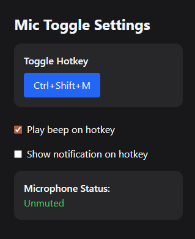

# Mic Toggle

A simple utility to toggle your microphone on and off with a keyboard shortcut.

## Features

- Toggle microphone mute/unmute with a single key combination.
- Customizable hotkey.
- Sound notification on toggle.
- System notification on toggle.
- Tray icon for quick access.

## Installation

Download the latest release from the [Releases](https://github.com/TiagoRibeiro25/Mic-Toggle/releases) page and run the executable.

## Usage

1. Run the application.
2. Use the default hotkey `Ctrl + Shift + M` to toggle the microphone.
3. Right-click the tray icon to access settings or exit the application.
4. Customize the hotkey and notification settings in the settings menu.

## License

This project is licensed under the MIT License. See the [LICENSE](LICENSE) file for details.
